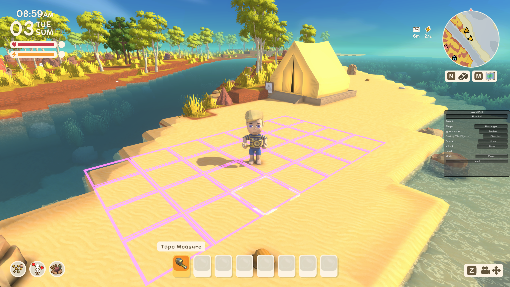
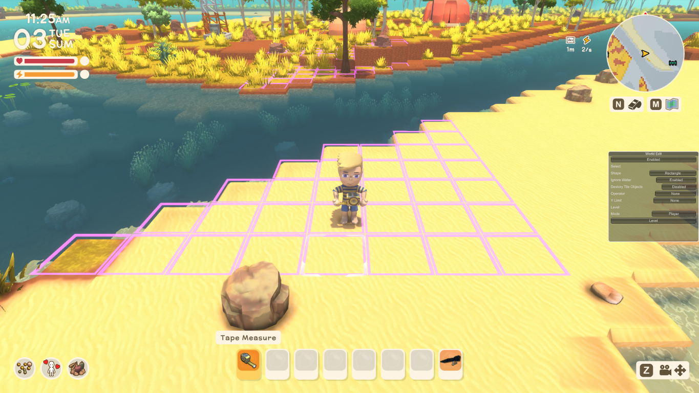

# Dinkum World Edit

A mod that adds the capability to do large changes to the landscape.

## Requirements
- Dinkum v1.0.7
- [MelonLoader v0.7.1 Beta](https://github.com/LavaGang/MelonLoader)
- [DivineDinkum](https://github.com/Decapitated/DivineDinkum) v1.0.0

## Features

### Selection Modes

Click to view...

| Rectangle |
| - |
|  |

| Circle |
| - |
|  |

| Flood Fill |
| - |
|  |

### Ignore Water Toggle
| Enabled | Disabled |
|-|-|
|  |  |

## Levelers:
  - Player - Levels to the same height as the player.
  - Max/Min/Avg - Level to the highest/lowest/average height of the selection.
  - Up/Down - Increase/Decrease the height of the selection at specified increments.

## Safe Destroy
Destory tile objects when leveling using built-in game methods to preserve things that should not be destroyed.

| Before | After |
|-|-|
|  |  |

## To-Do
- Improved UI
- Change ground type
- Add paths